# Hangman

##Introduction Welcome to Hangman! The project was made for a Java Programming class Individual Project. This project was made in an online class IDE called "CodeBoard".  I adapted the code and class setup to make it work with gradle to make it easier to post on GitHub. Enjoy!

##Installation Click here to download the zip folder that contains the program files. If that does not work, click the "Clone or download" button and select the option "Download Zip". Next, find the zip folder in your downloads folder. Unzip the folder to a convenient location. To run this project, you can run the jar file in the main folder.  

  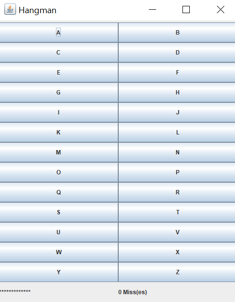

##Instructions The goal of this game is to guess the mystery word. Each turn the player chooses a letter to guess that they think is in the word. After each guess that tile will be disabled to prevent double guessing of a word. If the letter is in the mystery word, the placement in the mystery word will be revealed bellow. Default the mystery word to the user is "*****" depending on the number of letters in the word. If the chosen letter is not in the mystery word, the number of misses will be incremented. Be careful, because 6 missed letters will result in a loss! 

The default word is "inconceivable" for this game. To change the word, go into the Main.java file and change the String input into the HangmanGUI constructor on line 11. 

##Example Gameplay

  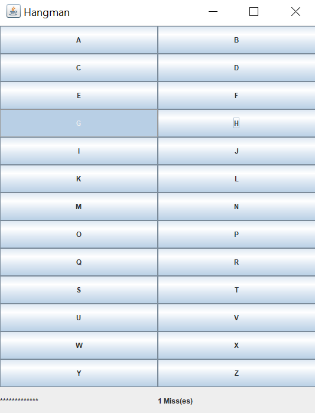

In this example, The Player guesses the letter "G". "G" is not in the mystery word, so the Missed letter counter is incremented. The "G" tile is also now disable to prevent another "G" guess.

  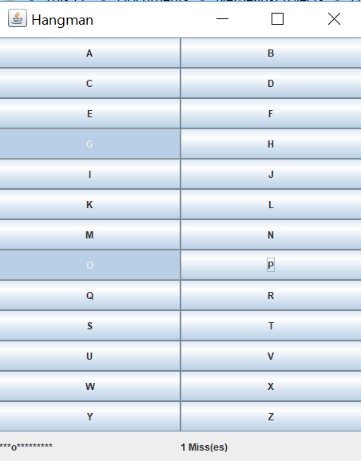

Next, the Player guesses "O". "O" is in the mystery word, so in the mystery word at the bottom shows an "O" in the corresponding place an "O" is found in the mystery word. 

  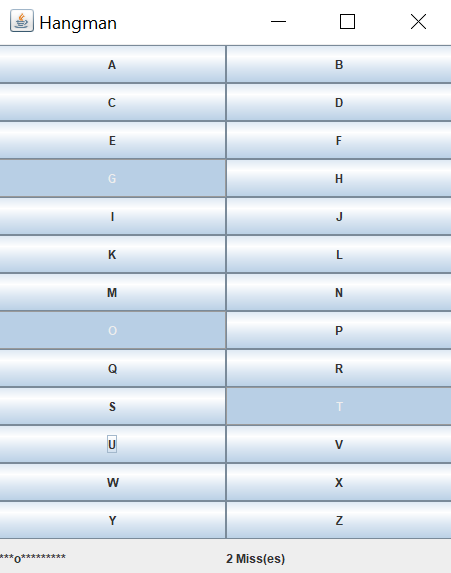

The Player guesses "T". "T" is not in the mystery word, so the number of misses is incremented by 1. The player now has 2 total misses.

  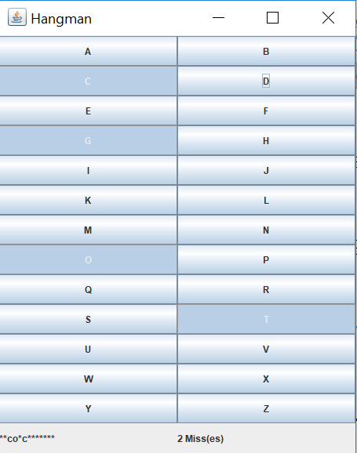

The Player guesses "C". "C" is in the mystery word twice, so the two places that "C" is in the mystery word are revealed to the Player.

  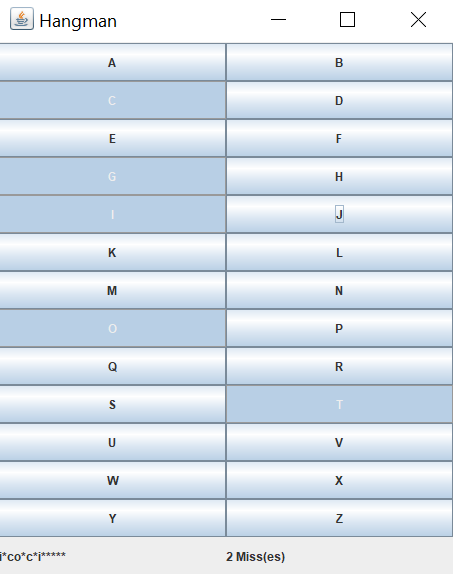

The Player guesses "I". "I" is in the mystery word twice also, so the two places that "I" is in the mystery word are revealed.

  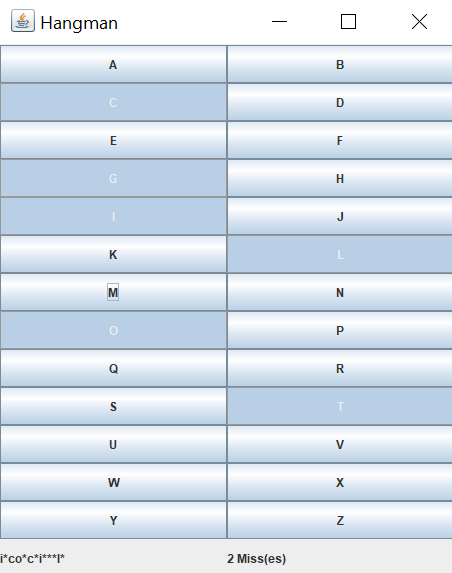

The Player guesses "L", and it is in the mystery word once. The corresponding location is revealed to the Player.

  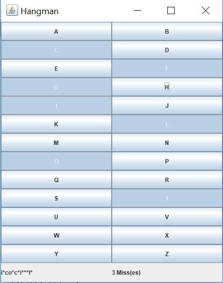

The Player guesses "T", and it is not in the mystery word. The number of misses is incremented to a total of 3 missed words.

  

The Player guesses "N", and it is in the mystery word twice. The locations of "N" in the mystery word are revealed to the Player.

  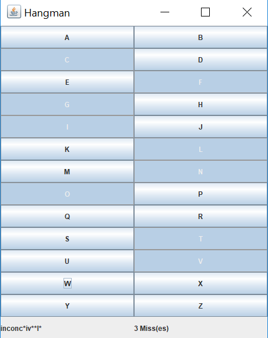

The Player guesses "V", and it is in the mystery word once. The location of "V" in the mystery word is revealed.

  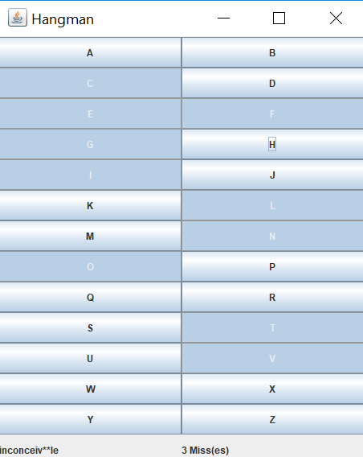

The Player guesses "E", and it is in the mystery word twice. The locations of "E" in the mystery word are revealed to the Player.

  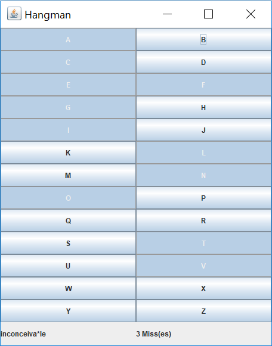

The Player guesses "A", and it is in the mystery word once. The location of "A" is revealed to the Player. There is now only 1 letter left in the mystery word!

  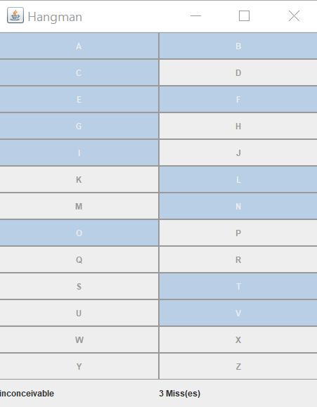

The Player guesses "B", and it is the final letter in the mystery word. The mystery word is revealed to be "inconceivable".

The Player has won!

##Acknowledgements

The professor of my Java Programming course provided the class structure and what methods needed to be completed. I wrote the game logic, the GUI and completed the methods that my professor told us to complete.
